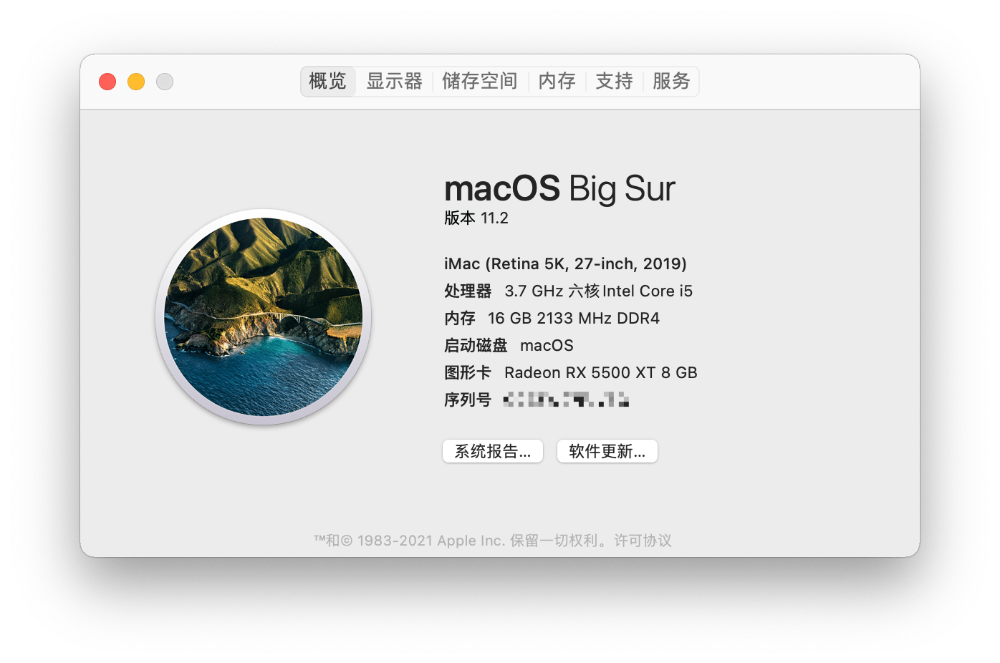
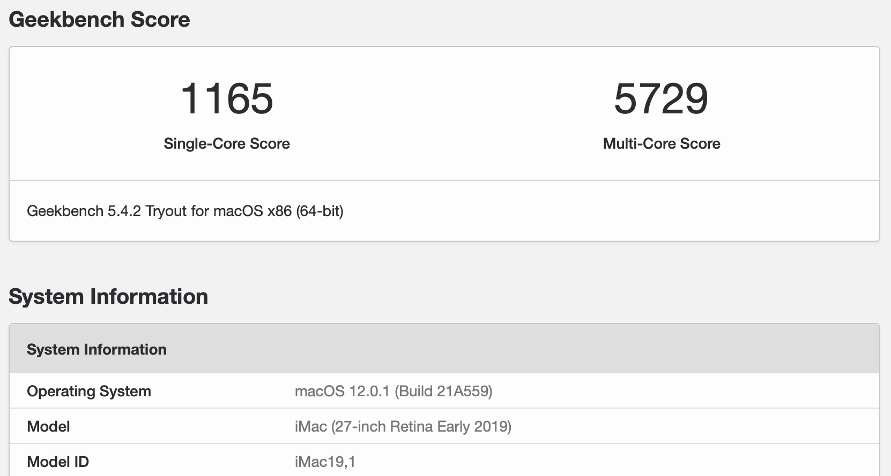
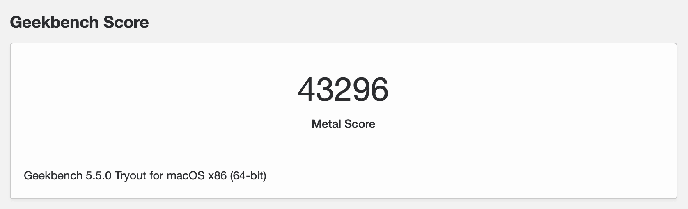
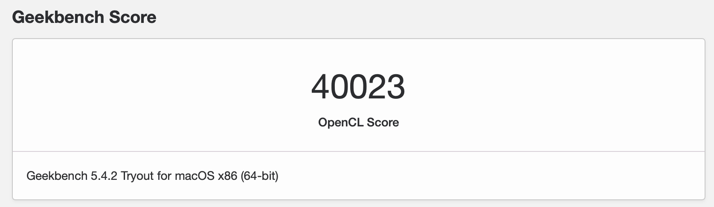

# ASRock Z390m-ITX/ac Hackintosh

[![Asrock](https://img.shields.io/badge/Z390M--ITX/ac-000.svg?style=flat&logo=data:image/png;base64,iVBORw0KGgoAAAANSUhEUgAAAGQAAAAUCAMAAABMHminAAAAjVBMVEUAAACGwiaFwiaGwyeGwyaFwSaDwiaFwyaGwiaFwiWEwiaEwiaEwyeFwiaFwiaFwiaFwyaFwiaFwiaFwiaGwiWEwiaFwiWFwiaLyySFwiaGwiWDwCWFwiaFwiWFwiaFwiaGwiWGwiaDwx6GwiWFwyaFwiWFwiaFwiWFwiaMximFwyWEwyWHwCaFwiaFwiaMZ9zAAAAALnRSTlMAqowzIpkTqWVcn7VV+/iId+/nf0xDOywD80gN4dvXyaVUCNK/r5J6cwaDbRrDyeGVrgAAAe1JREFUOMvtk+lyozAMgBXABlPucBVycIYcrd//8VYyLpvOBDqz+7ffTGIP0vizkIBf/pOPe7Mjaij27k5jCr1xJwvWyDB+Vbui+8GRyBkeyr9UxrINHrCCg1GbNvk13ZbYUiPka4n0i58klsg3HSYmvu9P+O/iccLU1Cg5R1HkksXBvM6scg4Llpm13lVLOs/z+JbkjQ5R/4OUJ1gw0ErrESMpWE1AtnM792KMJWFoCcnaDUeO8cNNSRj+9h6SWqWS9GEYjhSvW1IkPpVbAqfkJ0npYDTYqmTAvMdcT4G5moOHEo3/ZlFkyJ1qT9coP+npmBacO/Sq+3cajq1CMrphN0u6NJYL3iIZa8DGxDmeNdm4UfNx1Y3X+BlscMaMSHfmBlxEhIHn9Sg5NTgPuNSYNVAVR0fNB+Uukvjo00WLdUdKWfUi+eKCT+fGCzrhMuILpNQGH/pkk9XTCHMbl89VR9nTSwYtsTRmdcQ5miWqNQkJDGHfqwBFPKFOPOpFArcDrqulCErnWvIdoSWmJP2F3pU7YFknDnmi2pD051CPMIXFWiH0DYTwSsJASzqJmCAOkggYXYlfYvntO5nUiL7G3DWMfajttHvCNnKAljF1uTt+LBZeKIuMu+Bf1zOdKWTMY4w5NKO4ZvDLP/IHwbpgg9Ud2r0AAAAASUVORK5CYII=&labelColor=333&label=Asrock&color=green)](https://www.asrock.com/mb/Intel/Z390M-ITXac/index.asp)

## macOS 版本

- 13.1 (22C65)

## Opencore 版本

- 0.8.8

## 硬件配置

- Intel Core i5-9600K 3.70GHz
- ASRock Z390M-ITX/ac (BIOS Version: 4.30)
- USCORSAIR DDR4 3000 16GB (8G×2)
- Intel UHD Graphics 630
- Asrock Radeon RX 5500 XT Challenger D 8G OC
- HP SSD EX920 512GB `(macOS Ventura)`
- HP SSD S700 250GB `(Windows 11)`
- BCM94360CS2

## BIOS 设置

- CPU Configuration

  - Intel SpeedStep Technology -> Enabled
  - Intel Turbo Boost Technology -> Enabled
  - Intel Speed Shift Technology -> Enabled

- Advanced

  - CPU Configuration

    - CFG Lock -> Disabled
    - Software Guard Extensions (SGX) -> Disabled

  - Chipset Configuration

    - Primary Graphics Adapter -> PCI Express
    - Above 4G Decoding -> Enabled
    - C.A.M. (Clever Access Memory) -> Enable

      `注：[升级 BIOS](https://www.asrock.com/mb/Intel/Z390M-ITXac/index.asp#BIOS) 到测试版 4.30F(4.30G 不行) 后可以开启 Above 4G Decoding 和 C.A.M，然后使用 Opencore 0.7.5 以上版本并设置 ResizeAppleGpuBars 为 0，ResizeGpuBars 为 -1 就可以享受 Windows 下 AMD Smart Access Memory 技术带来的提升了；如果不使用测试版 BIOS，请关闭 Above 4G Decoding，并设置 OC 的 ResizeAppleGpuBars 为 -1`

    - IGPU Multi-Monitor -> Enabled
    - PCI Express Native Control -> Enabled // 可选
    - PCIE ASPM Support -> Auto // 可选
    - PCH PCIE ASPM Support -> Auto // 可选

  - Storage Configuration

    - SATA Mode Selection -> AHCI

  - USB Configuration

    - XHCI Hand-off -> Enabled

  - Trusted Computing
    - Security Device Support -> Enable

- Security

  - Secure Boot -> Disabled
  - Intel platform trust technology -> Enable

    `注: 开启 Security Device Support 和 Intel platform trust technology 就打开了 TPM 2.0 支持, 可以安装 Windows 11`

- Boot
  - CSM
    - CSM -> Disabled

## 工作正常

- CPU 变频节能正常
- 休眠唤醒正常
- 核显加速正常
- 5500 XT 显卡性能正常, Geekbench 5.1.1 跑分: Metal Score(41632), OpenCL Score(39026)
- 5500 XT 风扇 PMW 正常
- 5500 XT 温度检测 (Ventura 已支持)
- 有线网卡
- 无线网卡 + 蓝牙
- USB, 使用 [USBToolBox](https://github.com/USBToolBox/tool) 定制 USBMap.kext, [详情](Resources/USB/README.md)
- NVRAM（SSDT-PMC.aml）
- iMessage/FaceTime/Hand-off (修改三码)

## 使用说明

- 先修改三码后再使用
- 如果你的独立显卡和我不一样，请注意 [自定义显卡优化参数](Resources/5500XT/README.md)

## 一些图片

## [更新日志](./CHANGELOG.md)
