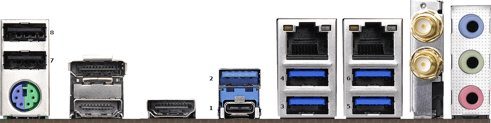

# USB 接口定制

## IO Panel

- 1
  - USB3(TYPE-C) - HS01 SS04
- 2
  - USB3 - HS02 SS03
- 3
  - USB3 - ~~HS03~~ SS02
- 4
  - USB3 - ~~HS04~~ SS01
- 5
  - USB3 - HS05 ~~SS05~~
- 6
  - USB3 - HS06 ~~SS06~~
- 7
  - USB2 - HS09
- 8
  - USB2 - HS10

## Front Panel
- 1
  - USB3 - HS07 SS07
- 2
  - USB3 - HS08 SS08

## Onboard
- Bluetooth
  - Internal - HS14